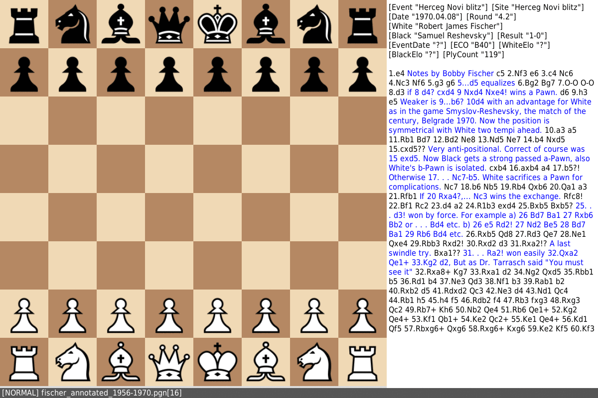

# Cboard

Simple pgn editor designed to be controlled by keyboard.

### Usage
See [Manual](./MANUAL.md)
### Build

Required header files: SDL3, SDL3\_image and SDL3\_ttf

`sudo make install`

### Credits

[SDL\_FontCache](https://github.com/grimfang4/SDL_FontCache) from Jonathan Dearborn  
[Alpha piece set](http://ixian.com/chess/jin-piece-sets/) from Eric De Mund
